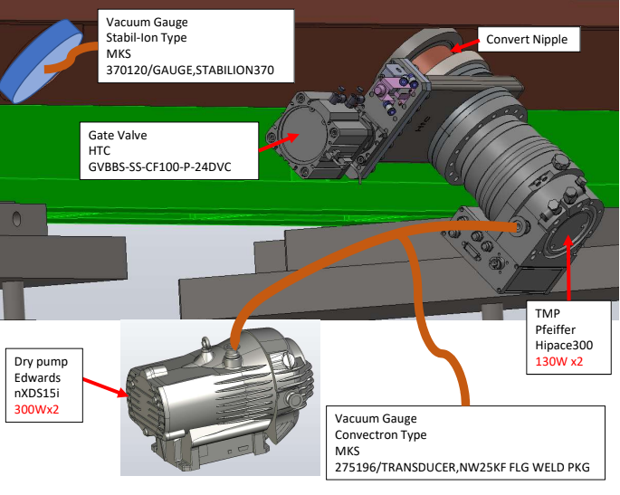

# RFQ Vacuum System
* <a href="https://github.com/bl-mirrotron/mirrotron-rfq-vacuum-tray" target="_blank">Source code</a>
* [Vacuum system overview](https://docs.bl-mirrotron.com/#vacuum-system)
* [Control system overview](https://docs.bl-mirrotron.com/)

The RFQ has two identical vacuum systems mounted on either side of the RFQ as shown in Figure 1. The RFQ vacuum system tray is responsible for:
* Control opening and closing of valves
* Read status of gate valve limit switches
* Read vacuum gauge pressures
* Read status of the turbo pumps
  - Turbo pump error status
  - Turbo pump 70% speed status
* RFQ Vacuum protection

The RFQ vacuum tray obtains its required data by communicating serially with the <a href="https://docs.bl-mirrotron.com/mirrotron-rfq-vacuum-cube/">RFQ Vacuum System Cube Controller</a>. The tray code is written in the <a href="https://nodered.org/" target="_blank">Node-RED</a> programming environment. The tray code uses the standard Blinky-Lite template for serial communication using Blinky-Bus as shown in Figure 2.

To protect the RFQ vacuum, the vacuum tray has logic that closes that gate valve if the scroll pump pressure exceeds their HIHI alarm pressure. In addition the gate valve will not respond to open settings if this HIHI scroll pump pressure is exceeded. Also the vacuum tray has logic that will close the gate valve if the turboSpeed bit toggles from Hi to Low. This will protect against the situation when someone turns off the turbo before closing the gate valve.

Figure 1.  RFQ Vacuum system layout

 

Figure 2.  RFQ Vacuum system flow

 
